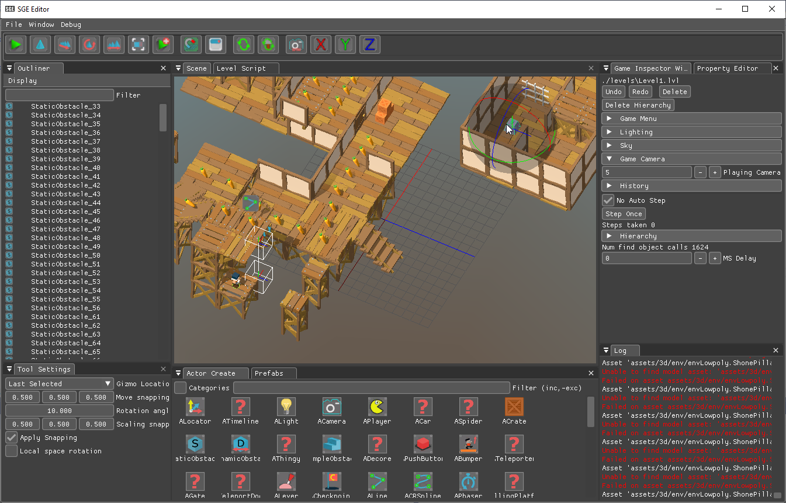
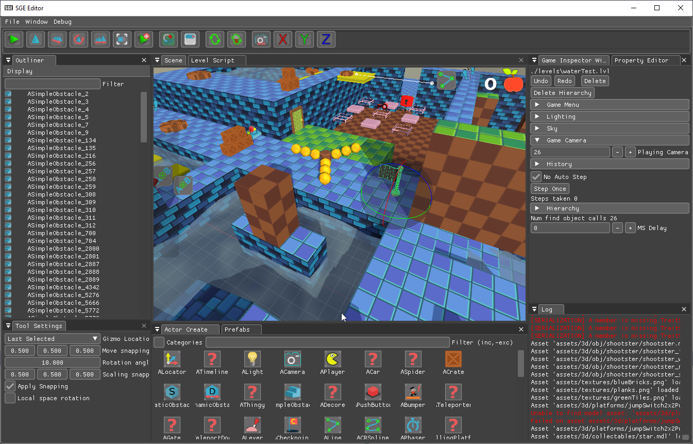
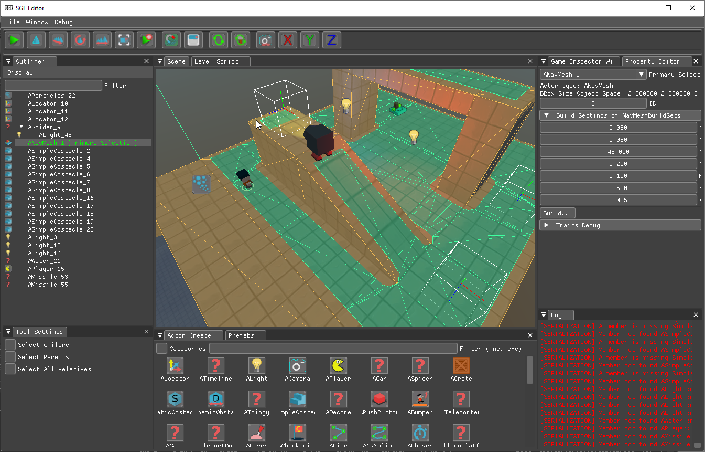
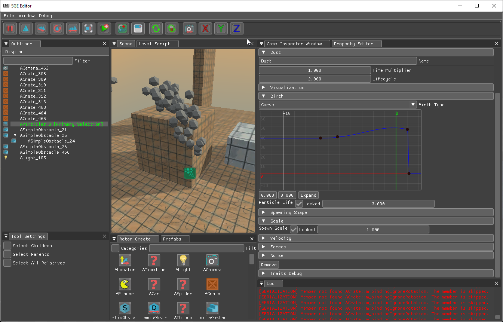
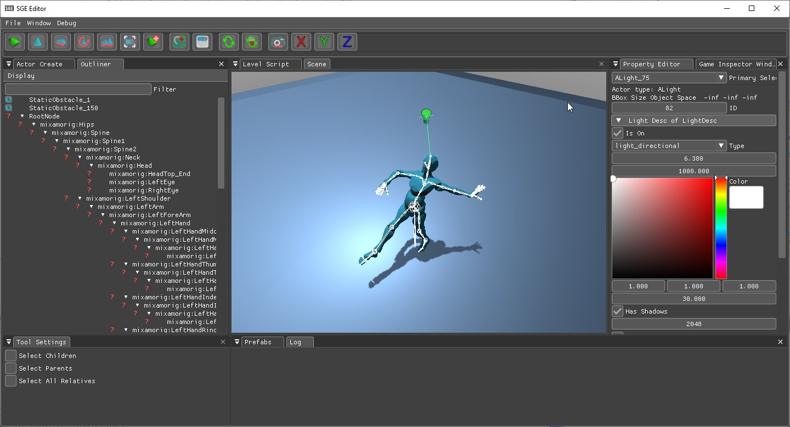

Work-in-Progress The official "early alpha" release should be available around April 2021

# SGEEngine

__SGEEngine__ is an open source __(MIT License)__, C++ centric game engine and 3D sandbox. Aimed as simple projects, SGEEngine is suitable for small games, game jams, learning, personal projects and can be used as a jump start for your own game engine.

The main features of the engine are:
 - Scene editor for 3D and pseudo 2D scenes. Having all common.features like transform, tools, property editor, undo/redo and more.
 - C++ hot reloading.
 - Direct3D 11 and OpenGL 3.3 (with WebGL in mind) rendering backends
 - Cross platform working on Windows and Lunix, with Emscripten on the way. Building for OSX should be possible.
 - Physics.
 - Path finding.
 - Timeline animations.

[

<source src="./docs/img/fruits.mp4" type="video/mp4">
